# Albo degli studenti anno 1 - 2021/2024

NB: che le immagini siano tutte JPG di dimensione massima 256x256 

## Progetti
| Titolo | Team | Repo |
|---|---|---|
| titolo | team | url |

## Docenti
|   | Nome | Corso | Team | Url |
|:---:|---|---|---|---|
| | Francesco Lanzo | Programming | - | [GitHub](https://github.com/franz0)   [GitLab](https://gitlab.com/franzo)  [Twitter](https://twitter.com/develoop_)|
| | Ilaria Baldassari | Cumulative | - | [GitHub](https://github.com/SheiraFenix)   [ArtStation](https://www.artstation.com/sheirafenix)|
| | Stefano Cecere | Cumulative | - | [GitHub](https://github.com/StefanoCecere)|
| | Vincenzo Santalucia | GameDesign | - | [GitHub](https://github.com/loSceiccoBeige)   [Website](https://www.vincenzosantalucia.design/)|

## Programming
|   | Nome | Corso | Team | Url |
| | Marco Chechi | Programming | Cutman | [github](https://github.com/Licantropo5)|
|:---:|---|---|---|---|
| | nome cognome | Programming | team name | [GitHub](https://github.com/Bolognesi-Alessio)|
| | Luca Gunnella | Programming | team bomberman | [GitHub](https://github.com/LucaGunnella)|
| | Leonardo Martelli | Programming | Team Elecman | [GitHub](https://github.com/LeonardoMartelli-coba)|
|| Moreno Melis| Programming | Team Fireman | [GitHub](https://github.com/MorenoMelis)|

## Game Design
|   | Nome | Corso | Team | Url |
|:---:|---|---|---|---|
| | nome cognome | Game Design | team name | [GitHub](https://github.com/GioanDavide)|
|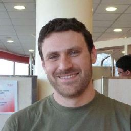 | Andrea Cianfanelli |  | Cutman | [GitHub](https://github.com/cinfa78)|
| | Alberto Sargenti |  | FireMan | [GitHub](https://github.com/AlbertoSargenti)|
|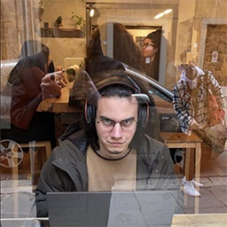 | Francesco Pieruccini |  | GutsMan | [GitHub](https://github.com/FrancescoPieruccini)|
|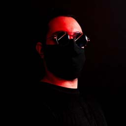 | Francesco Nannini |  | Bombman | [GitHub](https://github.com/BelethThynemenos)|
|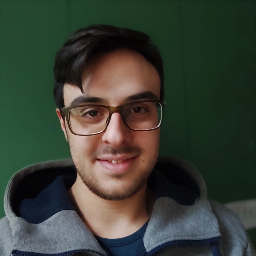 | Andrea Vanghi | Game Design | Gutsman | [GitHub](https://github.com/VanghiAndrea)|

## Concept Art
|   | Nome | Corso | Team | Url |
|:---:|---|---|---|---|
|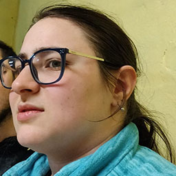 | Matilda Gori | Concept Art | Fireman | [GitHub](https://github.com/MatildaGori)   [ArtStation](https://www.artstation.com/uf12bbec5)|
| | nome cognome | Concept Art | team name | [GitHub](https://github.com/zeboo-svg)|
|| Maria Libera Demarcus| Concept Art | Team Bombman | [GitHub](https://github.com/Weeliox)|
| Michele Gabrielli | Concept Art | Team Bombman | [GitHub](https://github.com/MicheleGabrielli)|
<<<<<<< HEAD
|| Martina gramegna | Concept Art | Team Gutsman | [GitHub] (https://github.com/skeletrin14)| 

=======
|| Lorenzo Ferraina | Concept Art | Team Elecman | [GitHub](https://github.com/Lorenzo-Ferraina)|
|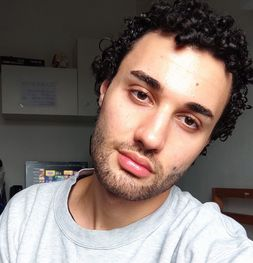| Mattia Monteduro | Concept Art | Team Bombman | [GitHub](https://github.com/MattiaMonteduro)|
|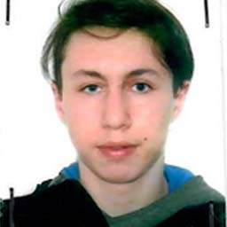| Claudio Zappi | Concept Art | Team Fireman | [GitHub](https://github.com/Claudio-Zappi)|
|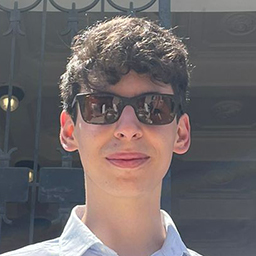| Alessio Ruggeri | Concept Art | Gutsman | [GitHub](https://github.com/AlessioRuggeri5)|
|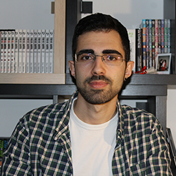| Daniele Aragona| Concept Art | Gutsman | [GitHub](https://github.com/DanieleAragona)|
|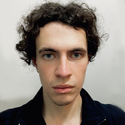| Lorenzo Valente| Concept Art | Gutsman | [GitHub](https://github.com/fendraw)|
|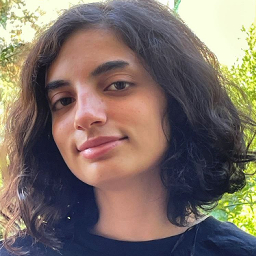| Eleonora Guidi| Concept Art | Cutman |[GitHub](https://github.com/astralraindrop)|
|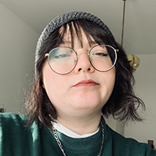| Roberta Vainella | Concept Art | Gutsman | [GitHub](https://github.com/RobertaVainella)|
|| Lorenzo Grimaldi | Concept Art | Cutman | [GitHub](https://github.com/Disappointmentcream)|
>>>>>>> f7e802bb6aed249d9f3f601627e52875ebc58297

## 3D Game Art
|   | Nome | Corso | Team | Url |
|:---:|---|---|---|---|
| | nome cognome | 3D Game Art | team name | [GitHub](https://github.com/cipincipancake)
<<<<<<< HEAD

=======
| | Matteo Ledda | 3D Game Art | BombMan | [GitHub](https://github.com/MatteoLedda)
|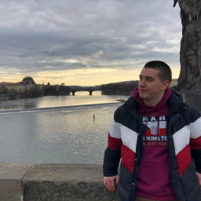 | Marco Gazzaniga | 3D Game Art | BombMan | [GitHub](https://github.com/MarcoGazzaniga)
|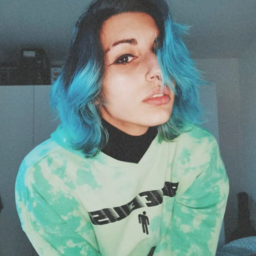 | Conti Asia Lara Giovanna | 3D Game Art | Gutsman | [GitHub](https://github.com/ContiAsiaLara)
| | Alessio Muller | 3D Game Art | Fireman | [GitHub](https://github.com/alessioMuller)
>>>>>>> f7e802bb6aed249d9f3f601627e52875ebc58297
